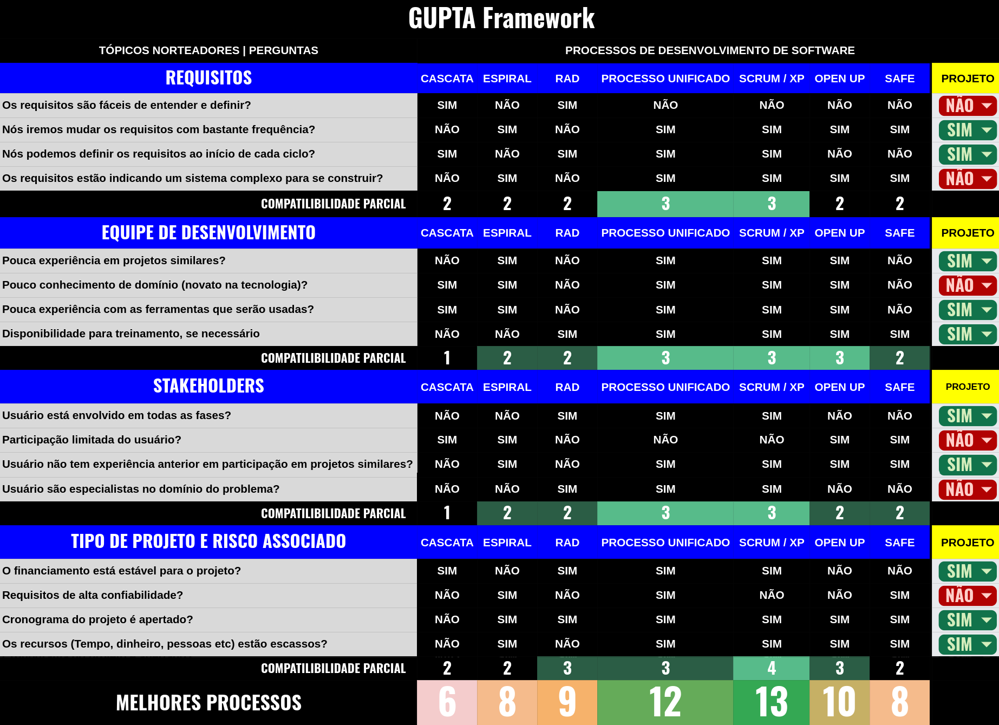

# 3. Estratégias de Engenharia de Software

##3.1 - Estratégia priorizada
**Abordagem de Desenvolvimento de Software:** Ágil

**Ciclo de vida:** Iterativo e Incremental 

**Processo de Engenharia de Software:** Scrum/XP

##3.2 - Quadro comparativo

Características     | Scrum/XP | Processo Unificado |  
-------- | ------ | --------- | 
Abordagem Geral | Iterativo e incremental. Possui um foco maior na agilidade, não priorizando documentação | Iterativo e incremental. Estrutura mais formalizada em termos de documentação |
Foco em arquitetura | A arquitetura é desenvolvida de forma incremental e evolutiva, com o foco em atender às necessidades imediatas do produto. Não há um design extenso ou detalhado no início do projeto | A arquitetura é desenvolvida de forma incremental e evolutiva, com o foco em atender às necessidades imediatas do produto. Não há um design extenso ou detalhado no início do projeto | 
Estrutura de Processos | Ciclos curtos(Sprints) de desenvolvimento. Processo ágil e flexível, se preocupando com a entrega contínua | Fases formais (Iniciação, Elaboração, Construção, Transição). Processo mais estruturado e documentado.
Flexibilidade de Requisitos | Alta flexibilidade movida por feedback do cliente a cada Sprint| Flexibilidade moderada. Requisitos são definidos inicialmente para maior controle e formalidade. Mas podem ser ajustados
Colaboração com o cliente | Alto envolvimento do cliente. Seja durante as Sprints revisando incrementos ou fornecendo feedbacks | Participação do cliente mais concentrado nas etapas iniciais e finais, de planejamento e transição. Revisões feitas depois de entregas significativas
Complexidade do processo | Processo mais simplificado. Com foco menor em documentação, e maior na autonomia da equipe | Maior complexidade, envolvendo múltiplas fases. Foco maior em planejamento e documentação
Práticas de Desenvolvimento |  Programação em par, integração contínua, testes automatizados, refatoração, design simples, e foco em qualidade contínua durante o desenvolvimento |Definição de arquitetura, modelagem detalhada e desenvolvimento iterativo
Controle de Qualidade | Testes automatizados, TDD (Test-Driven Development), através de integração contínua garantindo qualidade durante o desenvolvimento | O controle de qualidade é feito de forma mais estruturada, com foco em testes em várias fases
Suporte à equipes de Desenvolvimento | Equipes mais autônomas e colaborativas. Foco na comunicação e nas interações diretas para resolver problemas | Define papéis mais estruturados e tarefas específicas para os membros da equipe, com maior controle e supervisão sobre o processo

##3.3 - Justificativa

A escolha do processo foi baseada em uma adaptação do framework proposto por Gupta. Em tal framework, são feitas perguntas cujas respostas são "Sim" ou "Não" relacionadas aos requisitos, a equipe de desenvolvimento, aos stakeholders e ao tipo de projeto e seus riscos. A resposta da equipe à cada uma das questões propostas por Gupta indica o processo de desenvolvimento de software ideal para o projeto. As perguntas propostas estão elencadas na figura 1, bem como as respostas fornecidas pelo time de desenvolvimento.

Figura 1 - Escolha de processo através do framework Gupta adaptado

Fonte: Elaborado pelos autores (2024)

Conforme explicitado na figura 1, o processo de desenvolvimento de software mais indicado para o projeto é o Scrum/XP, uma combinação do Extreme Programming (XP) com o framework de gestão de projetos Scrum. Tanto Scrum, quanto XP foram desenvolvidos no contexto de abordagem ágil de desenvolvimento de software e ciclo de vida do produto iterativo e incremental.

O diferencial do Scrum/XP para o Unified Process na escolha através do framework já mencionado, foi a não existência de requisitos de alta confiabilidade. Por outro lado, a escolha do Scrum/XP já era desejada pelo time de desenvolvimento devido a experiências anteriores bem sucedidas com o processo.

---
## Histórico de Versão
Data     | Versão | Descrição | Autor | Revisores 
-------- | ------ | --------- | ----- | ---------
10/11/2024 | 0.1 | Tópico 3 | Arthur Miranda, João Pedro, Manuella Valadares | Daniel, Carol, Marcella